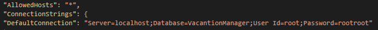
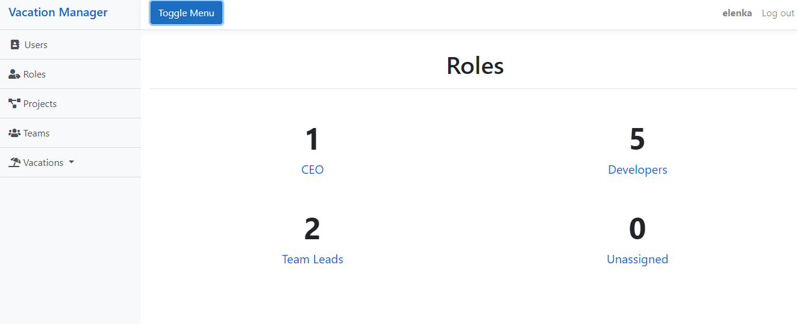
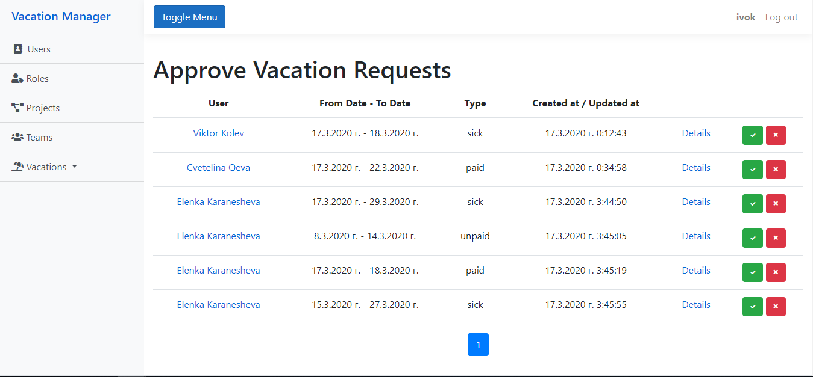

# Vacation-Manager-Project

Изисквания преди подкарване на проекта:
 - трябва да се създаде нов user за базата данни с име "*root*" и парола "*rootroot*". 

 - Това е постижимо чрез  "Microsoft SQL Server Management Studio" като типа на автентикацията трябва да е "*SQL Server Authentication*"

## Постигнати резултати 
 1. Компонент "**Users**":
	 - Показване на всики потребители в табличен изглед
	 
	 -  **Login** и **Sign up** - Login за вече съществуващи потребители, а Sign up, за такива, който да си създадат профил в системата. След създаването потребителя влиза в систмата автоматино и по default е с роля "*Unassigned*" и не принадлежи на ничии екип.
	 
	 
	 
	 - Страница с **детайлна** информнация за потребителя. 
	 - Възможност на потребителя да редактира своите данни, но **БЕЗ** да променя ролята си или членството си в даден екип
	 - Възможност на потребителя да трие своят профил 
	 
	 - CRUD от "*CEO*", като той може да променя ролята и екипа, към когото принадлежи потребителя
	 
 2. Компонент "**Roles**" :
	 - Показване на броя потребители от дадена роля
	 
	 - Филтриране на потребители според ролята
	 - **САМО** потребители с роля "*CEO*" има възможност да изпълнява CRUD на:
		 - потребители
		 - екипи
		 - проекти
	-  Потребители с роля "*CEO*" или "*Team Lead*" има възможност да одобряват заявки за отпуск, като потребителят с роля "*Team Lead*"  може да одобрява заявките **САМО** на членовете на **своя** екип
	
3. Компонент "**Teams**" :
	- Показване на всики екипи в табличен изглед
	
	- Create + Delete на проекти от "*CEO*", като един екип трябва да съдържа минимално двама програмиста и максималко петима, както и един лидер. След създаването на екипа програмистите получават роля "*Developer*", а лидерът - "*Team Lead*"  
	- екипът задулжително трябва да има проект, върху който работи 
	- след изтриването на екипа всички участници получават роля "*Unassigned*" и не членуват в никакъв екип. Това е валидно и за лидерът на екипа.
	
4. Компонент "**Projects**" :
	- Показване на всики проекти в табличен изглед
	
	- CRUD от "*CEO*"
	
5. Компонент "**Vacations**" :
	- Възможност за разглеждане и изпращане/одобряване на заявки за отпуск, **САМО** когато потребителят е влязъл в системата
	
	- При потребители с роля "*Unassigned*" или "*Developer*":
		- може да изпраща различни заявки и да ги разглежда в табличен вид 
		- ако заявката е одобрена или отхвърлена (според иконката най-вляво - "✓" или "✗", или още описано в детайлния изглед) потребителят може **САМО** да я разглежда по **детайлно**, т.е. ако е платен/неплатен отпуск да види дали е на половин работен ден или ако е болничен да се разгледа каченият файл на здравния картон
		- ако заявката все още не е одобрена (Pending - синя иконка с три точки) това означава, че заявката все още не е одобрена и портебителят междувременно може да редактира (заявка се разбира, че е била редактирана с маркера "*(editted)*") или изтрие заявката
	- При потребители с роля "*Team Lead*":
		- Горепосоченото е абсолютно еднозначно и за потребителите с роля  "*Team Lead*", т.е. и те могат да изпращат заявки
		- могат да одобряват заявките за отпуск **САМО** на членовете на **неговият** екип. Това се случа на отделен изглед.
	
	- При потребители с роля "*CEO*":
		- Най-високи права. Може да одобрява заявките на **ВСИЧКИ** потребители в системата, но **не може** да изпраща такива

6. **Валидации** при създаване и редактиране на различните компоненти

Приятно Разглеждане!
